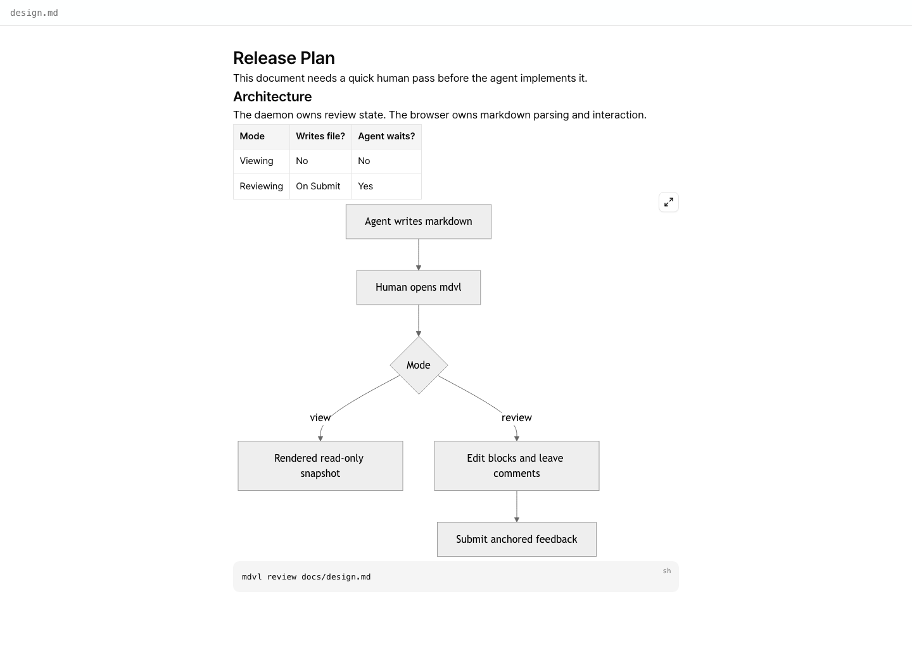
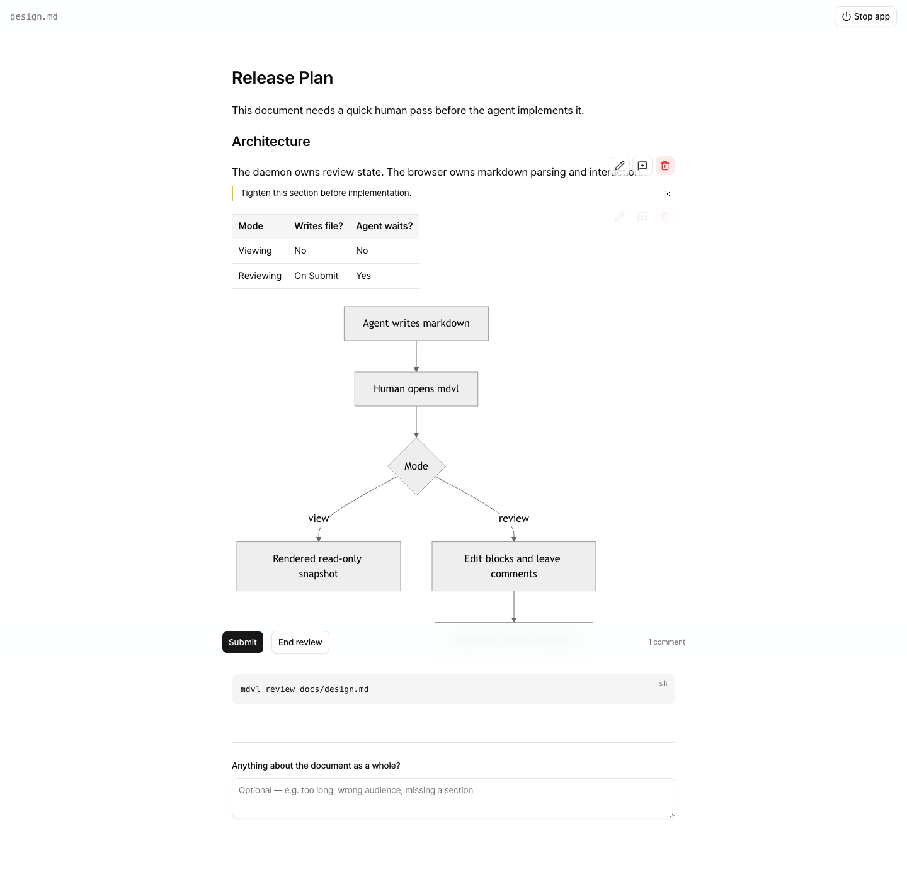

# mdvl

Hand a markdown file to a human, wait, and get back their judgement.

As every day vibe coding, I needed a markdown viewer with mermaid support.
Also needed a simple review method for markdown files which AI made.

`mdvl` is a command-line tool with a browser reader for markdown. An agent
writes a plan, a spec, an ADR; reading it in a terminal means raw markdown —
mermaid unparsed, tables as pipe characters — and every correction described back
in prose.

Use `mdvl view` when you only need a rendered snapshot. Use `mdvl review` when
the human should edit blocks, leave anchored comments, and hand an outcome back
to the agent.

```
you:    /md-review docs/plan.md
agent:  mdvl review docs/plan.md   →  rv_8f3a, your browser opens
you:    (read, edit, comment, Submit)
agent:  mdvl wait rv_8f3a          →  your comments, with line numbers
```

## Install

Install the binary via npx (Node 22+, npm 10+ required):

```bash
npx --yes @flyingmt/mdvl@latest
mdvl install                  # puts the skill into this project's agent tooling
```

Update or pin a specific version:

```bash
npx --yes @flyingmt/mdvl@latest            # update to newest
npx --yes @flyingmt/mdvl@0.1.8             # install exact version
npx --yes @flyingmt/mdvl@latest uninstall  # remove
```

**Supported platforms**: macOS 11+ (arm64, x64), Windows 10+ (x64), Linux glibc
2.17+ (x64, arm64). The installed binary has no runtime dependencies — Node is
only needed for the npx bootstrap.

Or build from source (needs `web/build` — see Development):

```bash
cargo install --path .
```

`mdvl install` writes a `md-review` skill into whichever of `.claude/skills`,
`.agents/skills` or `.codex/prompts` your project already has. It marks the skill
so the agent cannot invoke it on its own — you start reviews, not the agent.

## Viewing

`mdvl view <path>` opens the file rendered in the browser and stops there. No
Review is registered, no agent waits, and nothing in the tab can write to disk.
It is a static snapshot: if the file changes, run `mdvl view` again.



## Reviewing

You start a review — the agent cannot. Say `/md-review <path>` and a tab opens
with the document rendered: mermaid diagrams drawn, tables scrolling in their own
box, code fences byte for byte.



- **Hover or tab to a block** and its controls appear: edit, comment, delete —
  a mermaid block adds a ⤢ that opens the diagram full-window to pan and zoom.
- **Edit** shows that block's markdown, not a rich-text approximation.
  ⌘/Ctrl+Enter accepts, Escape backs out.
- **The `+` between two blocks** inserts a new one there.
- **A comment** is an instruction to the agent, anchored to that block — it comes
  back with the block's line range and a quote. Ask a question instead and the
  agent answers it.
- **The box at the end** is for anything about the document as a whole.
- **Submit** writes your edits to the file and hands your comments to the agent.
  **End review** returns nothing and leaves the file untouched.
- Nothing reaches the file until Submit, so experiment freely.
- **Stop app** in the header shuts the daemon down, and the review with it.

Deleting a block that carries comments, and ending a review, are the only two
actions that ask again first.

## Commands

| Command                      | What it does                                               |
| ---------------------------- | ---------------------------------------------------------- |
| `mdvl review <path>`         | Opens the file for review. Prints a review id and returns. |
| `mdvl view <path>`           | Opens the file read-only — a snapshot; nothing is registered. |
| `mdvl wait <id> [--timeout]` | Prints the result as JSON. Exit 0/2/3/4.                   |
| `mdvl install`               | Installs the review skill into agent tooling.              |

Installer lifecycle (via npx):

| Command                                   | What it does                                  |
| ----------------------------------------- | --------------------------------------------- |
| `npx --yes @flyingmt/mdvl@latest`         | Install or update to the newest release.      |
| `npx --yes @flyingmt/mdvl@<version>`      | Install an exact version (downgrade).         |
| `npx --yes @flyingmt/mdvl@latest uninstall` | Remove the binary, receipt, and PATH config. |

Set `MDVL_NO_BROWSER=1` and `review` prints the reviewer's URL on stderr instead
of opening anything — for machines with no browser to open, and for the tests.

`wait` exits `0` when the human submitted, `2` while they are still reading (run
it again), `3` if they ended the review, and `4` if the file changed underneath
them. On `submitted` the result carries their comments, each with the line range
of the file **as submitted** and a quote of what it was anchored to.

Reading takes minutes, so `wait` is meant to be run again on `2` — the whole
agent side of a review is:

```bash
id=$(mdvl review docs/plan.md)
while true; do
  mdvl wait "$id" --timeout 300
  code=$?
  [ "$code" -eq 2 ] || break
done
```

On `4` nothing of the reviewer's was written: their version is at the path in
`conflict_copy`, to be reconciled with what is now on disk.

## What it will not do

It serves one project at a time and refuses any path outside that project's root.
It listens on loopback only, behind a token generated per daemon. It writes the
file once, on Submit, and only if the file's digest still matches what it was
when the review began — otherwise your version is parked in
`<name>.mdvl-conflict.md` and nothing is overwritten.

The installer refuses to overwrite an `mdvl` binary it did not install, verifies
SHA-256 checksums before any filesystem change, and never requires administrator
rights.

## Development

The Rust binary embeds the built SvelteKit app, so the web build comes first:

```bash
cd web && npm install && npm run build
cd .. && cargo build
```

Then:

```bash
cargo test                      # the agent's contract, through the real binary
cd web && npx playwright test   # the reviewer's contract, through a real browser
cd web && npm run lint          # prettier + eslint
cargo clippy --all-targets
node installer/test/bootstrap.test.js  # installer unit tests (Seam C)
```

A debug build reads `web/build` from disk at run time rather than embedding it,
so a frontend change needs `npm run build` and a refresh — not a Rust rebuild.
Release builds embed it.

For a live frontend loop, run `npm run dev` in `web/` and build the daemon with
`--features dev-proxy`: it serves the page straight from Vite while the API keeps
answering from the same origin, so nothing about authentication differs from a
real build.

## Releasing

`Cargo.toml` carries the version; everything else is derived from the tag.

```bash
# bump Cargo.toml, then let cargo refresh the lockfile
cargo build
git commit -am "Release 0.1.3" && git push
git tag v0.1.3 && git push origin v0.1.3
```

The release workflow refuses to start if `Cargo.toml` and the tag disagree, so a
forgotten bump costs a retag rather than binaries that misreport their own
version. The npm root package's version and its five `optionalDependencies` pins
are stamped from the tag at publish time — the numbers committed in
`installer/package.json` are a placeholder, not the source of truth.

The design lives in [CONTEXT.md](./CONTEXT.md) — the vocabulary —
[docs/adr](./docs/adr), which records the decisions a reader would otherwise
question, [docs/design](./docs/design) for the reviewer's screen,
[.out-of-scope](./.out-of-scope) for what this project decided not to build, and
[docs/research](./docs/research) for the installer and platform research that
informed the npx Binary Installer.
