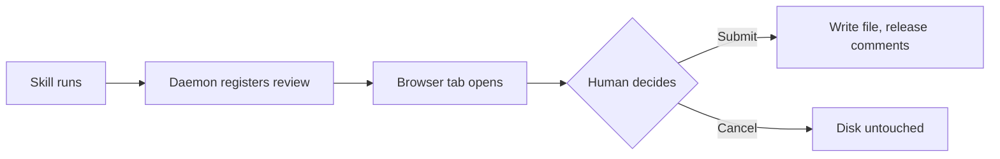

# md-view-linker

A coding agent hands a markdown file to a human, waits, and gets back the human's
judgement. A human can also open a file just to read it — that is a **View**.

## Language

A **Review** is one human pass over one markdown file, identified by a review id.
It ends at Submit or Cancel; it does not span rounds. A **Block** is one top-level
element of the markdown document — heading, paragraph, list, code fence, mermaid
diagram — and is the unit a human edits or comments on.

> The file being reviewed was written by an Agent, which may have been reading from
> the open web — its markdown is not trusted, so raw HTML never survives into the page.

### 한국어 본문 확인

에이전트가 마크다운 파일을 넘기면 사람이 브라우저에서 읽고 판단을 돌려준다.
읽는 사람은 문장을 평가하러 온 것이지 화면을 감상하러 온 게 아니다. 그래서 렌더링은
조용해야 하지만, 조용한 것과 구조가 안 보이는 것은 다르다. 긴 문서를 훑을 때
`h2`와 `h3`가 구분되지 않으면 사람은 위치를 잃는다.

## What a reviewer does

1. Reads the document top to bottom.
2. Edits a Block in place, or leaves a Comment anchored to its line range.
3. Submits — the edits are written to disk and the Comments are released to the Agent.

- Nothing is written until Submit. Cancel leaves the file on disk untouched.
  - A Conflict means the file changed after the Review began, so Submit refused to write.
  - The human's edits are not applied and the Agent is told why.
- `mdvl view` opens the same Block rendering with every control removed.

- [x] Blocks carry a line range back to the file
- [x] Comments are anchored, not free-floating
- [ ] ~~Inline suggestions~~ — out of scope

## Block kinds

| Kind | Editable | Carries comments | Notes |
| --- | --- | --- | --- |
| `heading` | yes | yes | h1–h6, one per Block |
| `paragraph` | yes | yes | The default kind |
| `list` | yes | yes | Ordered, unordered, task |
| `table` | yes | yes | GFM, scrolls inside its own box |
| `code` | yes | yes | Never passes through the markdown pipeline |
| `mermaid` | yes | yes | Rendered to SVG, zoomable |

## Starting a review

The Agent never starts a Review on its own — a human runs the Skill, which shells out:

```bash
mdvl review docs/design/reviewer-app.md --wait
# → opens http://127.0.0.1:7681/r/8f3c1a
# ← blocks until the human hits Submit or Cancel
```

The daemon answers with the Outcome, which the Agent reads as JSON:

```json
{
  "status": "submitted",
  "comments": [
    { "lines": [12, 18], "body": "This paragraph assumes the reader knows what a Block is." }
  ]
}
```

A code sample is the one Block whose text must survive exactly, so it never goes near
the markdown pipeline — see [ADR-0001](docs/adr/0001-markdown-parsing-in-the-browser.md).

## Lifecycle



---

## Notes

One daemon serves one Project Root, and no file outside it can be reviewed. The daemon
exits when the last Review ends, so nothing lingers after the human is done. Terms to
*avoid* in this codebase: session, task, request for **Review**; node, section, chunk
for **Block**.
